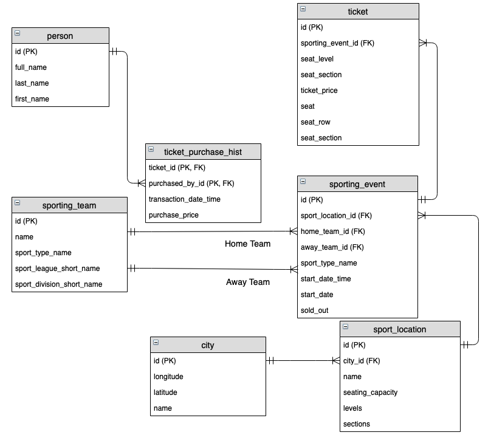
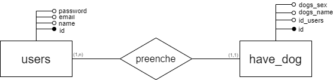

# Atividade ponderada 3 - Modelagem de Banco de Dados

**Projeto:** Abandono Zero

**Data:** 2024-05-10

**Autor:** Giovanna Fátima de Britto Vieira

**Objetivo:** Descrever o modelo relacional do projeto de forma resumida e simplificada.

## 1. Introdução
Ao iniciar o desenvolvimento de um sistema é necessário planejar todas as etapas e principalmente estruturar o banco de dados. Para isso, é utilizado uma técnica conhecida por modelagem de dados, que tem por objetivo transformar uma ideia conceitual em algo que pode ser traduzido em termos computacionais [1]. 

Sendo assim, para garantir que o banco de dados funcione corretamente e para manter a integridade dos dados é estipulado um processo de desenvolvimento de um projeto de banco de dados [1], composto por quatro fases principais, sendo essas:

1. **Levantamento e Análise das Necessidades:** por meio de entrevistas com os clientes, procura-se entender e documentar os requisitos de dados, além de especificar as operações que a aplicação deve executar com os dados[1].

2. **Projeto Conceitual:** descrição detalhada e concisa dos tipos de entidades, os relacionamentos e as restrições, por meio do Diagrama Entidade-Relacionamento (DER)[1].

3. **Projeto Lógico do Banco de Dados:** implementação do banco de dados, utilizando um sistema de gerenciamento de banco de dados (SGBD)[1].

4. **Projeto Físico do Banco de Dados:** definição da estrutura de armazenamento interno e os métodos de acesso aos arquivos do banco de dados, além de projetar as aplicações que irão manipular os dados [1].

### 1.1. Modelo Entidade-Relacionamento (MER)
Em 1976, Peter Chen concebeu o Modelo Entidade-Relacionamento baseando-se na teoria de bancos de dados relacionais, proposta por Edgard F. Codd. Esse modelo consiste em um modelo conceitual de dados que representa a semântica associada aos dados, dessa forma descreve as entidades e os relacionamentos entre elas, sendo utilizado durante a segunda fase do desenvolvimento de um banco de dados[1]. 

Nesse modelo, há a representação do grupos de objetos que formam um negócio: as entidades e os relacionamentos, que são ligados por uma ação. Esses objetos são abstrações do mundo real, então, na modelagem conceitual dos dados é necessário transportar os elementos do "mundo real" para o sistema que está sendo projetado, e esse transporte é realizado por meio de três componentes, sendo esses: modelo conceitual, modelo lógico e o modelo físico[1].

#### 1.1.1. Modelo Conceitual
O modelo conceitual consiste na primeira etapa do projeto e consiste na representação da realidade por meio de uma visão global e genérica dos dados e seus relacionamentos[1]. Sendo assim, esse modelo contém infromações da realidade que será armazenada no banco de dados (BD), mas sem retratar os aspectos do banco de dados [2].

Como essa representação é independente da tecnologia e da aplicação, esse modelo pode ser atualizado com facilidade. Então, o objetivo de utilizar o modelo conceitual é organizar e definir conceitos e regras baseadas em requisitos de caso de uso[3].

Figura 1 - Exemplo de Modelo Conceitual

Fonte: Modelagem de Bancos de Dados(2017)

#### 1.1.2. Modelo Lógico
A segunda etapa da descrição compreende a descrição das estruturas por meio de uma representação gráfica dos dados de forma lógica e nomeando os componentes presentes no banco de dados [1]. Dessa forma, O modelo lógico compreende uma versão mais refinada do modelo conceitual, já que representa as restrições de dados, os nomes de entidades e os relacionamentos para implementação de forma independente [4].

Sendo assim, por meio do modelo lógico é possível visualizar os processos operacionais de um diagrama de relacionamento entre entidades[4]. 

Figura 2 - Exemplo de Modelo Lógico

Fonte: Modelo de Dados Lógicos X Físicos([20--])

#### 1.1.3. Modelo Físico
O modelo físico é o detalhamento dos componentes da estrutura física do banco de dados, de forma que auxilia na implementação da lógica de negócios em um banco de dados físicos[1]. Além disso, nesse modelo, está presente o mapeamento de todas as entidades, das chaves primárias e  das chaves estrangeiras [4]. 

Figura 3 - Exemplo de Modelo Lógico

Fonte: Modelo de Dados Lógicos X Físicos([20--])

## 2. Modelagem do Banco de Dados do Projeto
Considerando todos os conceitos apresentados anteriormente, para o desenvolvimento dessa modelagem do banco de dados, seguiu-se a ordem de execução dos modelos, dessa forma, foram produzidos os modelos conceituais, lógicos e físicos da aplicação, conforme consta abaixo.

### 2.1. Modelo Conceitual
O primeiro modelo construído foi o modelo conceitual, dessa forma é possível visualizar as entidades e os relacionamentos entre elas.

Figura 4 - Modelo Conceitual

Fonte:  Material produzido pelo autor (2024) 

Nesse modelo conceitual está presente duas entidades: `users` e `resenha`, que se relacionam por meio de uma ação chamada de `preenche`. Além disso, o relacionamento desse modelo possui a cardinalidade um para um (1:1).

Figura 5 - Modelo Conceitual

Fonte:  Material produzido pelo autor (2024) 

No segundo modelo conceitual, está presente a mesma entidade `users` e uma outra entidade `dont_want_dog`, que se relacionam por uma ação chamada `preenche`. Além disso, o relacionamento desse modelo possui a cardinalidade um para muitos (1:N).

Figura 6 - Modelo Conceitual

Fonte:  Material produzido pelo autor (2024) 

No terceiro modelo conceitual, está presente a mesma entidade `users` e uma outra entidade `have_dog`, que se relacionam por uma ação chamada `preenche`. Além disso, o relacionamento desse modelo possui a cardinalidade um para muitos (1:N).

Figura 7 - Modelo Conceitual

Fonte:  Material produzido pelo autor (2024) 

No quarto modelo conceitual, está presente a mesma entidade `users` e uma outra entidade `had_dog`, que se relacionam por uma ação chamada `preenche`. Além disso, o relacionamento desse modelo possui a cardinalidade um para muitos (1:N).

Figura 8 - Modelo Conceitual

Fonte:  Material produzido pelo autor (2024) 

No quinto modelo conceitual, está presente a mesma entidade `users` e uma outra entidade `want_dog`, que se relacionam por uma ação chamada `preenche`. Além disso, o relacionamento desse modelo possui a cardinalidade um para muitos (1:N).

Figura 9 - Modelo Conceitual

Fonte:  Material produzido pelo autor (2024) 

No sexto modelo conceitual, as entidades se diferem dos modelos anteriores, sendo uma entidade `had_dog` e uma outra entidade `reasons_to_have_the_dog`, que se relacionam por uma ação chamada `contem`. Além disso, o relacionamento desse modelo possui a cardinalidade um para muitos (N:N).

Figura 10 - Modelo Conceitual

Fonte:  Material produzido pelo autor (2024) 

No sétimo modelo conceitual, as entidades presentes são `have_dog` e `reasons_to_have_the_dog`, que se relacionam por uma ação chamada `contem`. Além disso, o relacionamento desse modelo possui a cardinalidade um para muitos (N:N).

Figura 11 - Modelo Conceitual

Fonte:  Material produzido pelo autor (2024) 

Por fim, no último modelo conceitual, as entidades presentes são `want_dog` e `reasons_to_have_the_dog`, que se relacionam por uma ação chamada `contem`. Além disso, o relacionamento desse modelo possui a cardinalidade um para muitos (N:N).

### 2.2. Modelo Lógico
Considerando os modelos conceituais, foi possível desenvolver o modelo lógico utilizando o software <a href="https://sql.toad.cz/">SQL Designer</a>

Figura 12 - Modelo Lógico

Fonte:  Material produzido pelo autor (2024) 

Esse diagrama pode ser acessado ou alterado por meio do arquivo em xml gerado. Para acessar esse diagrama [Clique aqui](modelagemRelacional.xml)

### 2.3. Modelo Físico
Por fim, utilizando o Dbeaver foi possível realizar o modelo físico do banco de dados, obtendo o seguinte diagrama:

Figura 13 - Modelo Físico

Fonte:  Material produzido pelo autor (2024) 

Esse modelo físico pode ser gerado por meio do código em sql, que para acessar basta [Clicar aqui](modeloFisico.sql)

## 3. Conclusão
Por meio de todos os modelos produzidos é possível descrever essa arquitetura em suas entidades e relacionamentos.

### 3.1. Entidades

- **Users** (`users`): Armazena informações básicas sobre os usuários.
    - **id:** Identificador único do usuário (chave primária).
    - **name:** Nome do usuário.
    - **email:** Endereço de e-mail do usuário.
    - **password:** Senha do usuário.
    - **role:** Papel ou função do usuário no sistema.
    - **first_name:** Primeiro nome do usuário.
    - **last_name:** Sobrenome do usuário.
    - **social_name:** Nome social do usuário.
    - **phone:** Número de telefone do usuário.

- **Review Form** (``review_form`): formulário de resenha com informações gerais dos usuários.
    - **id:** Identificador único do formulário de revisão (chave primária).
    - **id_users:** Chave estrangeira vinculada ao ID do usuário.
    - **age:** Idade do usuário.
    - **gender:** Gênero do usuário.
    - **education:** Nível de educação do usuário.
    - **housing:** Tipo de moradia do usuário.
    - **family_composition:** Composição familiar do usuário.
    - **income_bracket:** Faixa de renda do usuário.
    - **household_members:** Número de membros no domicílio do usuário.
    - **country:** País de residência do usuário.
    - **state:** Estado de residência do usuário.
    - **city:** Cidade de residência do usuário.
    - **neighborhood:** Bairro de residência do usuário.

- **Present Form** (`present_form`): formulário a ser respondido pelos tutores que possuem cachorro.
    - **id:** Identificador único do formulário presente (chave primária).
    - **id_users:** Chave estrangeira vinculada ao ID do usuário.
    - **dog_name:** Nome do cachorro.
    - **gender:** Gênero do cachorro.
    - **belongs_to:** A quem o cachorro pertence.
    - **neutered:** Indicador se o cachorro é castrado.
    - **neuter_date:** Data da castração.
    - **cohabitation_duration:** Duração da coabitação com o cachorro.
    - **first_dog:** Indica se é o primeiro cachorro do usuário.
    - **dog_count:** Número de cachorros.
    - **cat_count:** Número de gatos.
    - **dog_age:** Idade do cachorro.
    - **breed:** Raça do cachorro.
    - **acquisition_source:** Fonte de aquisição do cachorro.
    - **paid:** Indica se houve pagamento pelo cachorro.
    - **age_arrived:** Idade do cachorro quando chegou.
    - **dog_personality:** Personalidade do cachorro.
    - **dog_characteristics:** Características do cachorro.
    - **adoption_agents:** Agentes de adoção.
    - **other_dog:** Outros cachorros.
    - **vet_visits:** Visitas ao veterinário.
    - **about_dog:** Informações adicionais sobre o cachorro.

- **Past Form** (`past_form`): formulário a ser respondido pelos tutores que não possuem cachorros, mas que já tiveram.
    - **id:** Identificador único do formulário passado (chave primária).
    - **id_users:** Chave estrangeira vinculada ao ID do usuário.
    - **dog_name:** Nome do cachorro anterior.
    - **belongs_to:** A quem o cachorro pertencia.
    - **dog_personality:** Personalidade do cachorro anterior.
    - **cohabitation_time:** Tempo de coabitação com o cachorro.
    - **first_dog:** Indica se foi o primeiro cachorro do usuário.
    - **cat_count:** Número de gatos durante a convivência.
    - **dog_count:** Número de cachorros durante a convivÊncia.
    - **dog_years:** Anos de vida do cachorro.
    - **neutered:** Indica se o cachorro era castrado.
    - **neuter_date:** Data da castração do cachorro.
    - **dog_breed:** Raça do cachorro.
    - **dog_origin:** Origem do cachorro.
    - **paid_value:** Valor pago pelo cachorro.
    - **pet_characteristics:** Características do pet.
    - **adoption_agents:** Agentes de adoção envolvidos.
    - **liked_most:**  O que mais gostava no cachorro.
    - **liked_least:** O que menos gostava no cachorro.
    - **vet_visits:** Indica se o cachorro visitava o veterinário.
    - **vet_visit_count:** Número de visitas ao veterinário.
    - **stopped_cohabitation:** Quando parou a coabitação com o cachorro.
    - **reasons_stopped_cohabitation:** Razões para parar de conviver.
    - **would_cohabitate_new_dog:** Disposição para conviver com novo cachorro.

- **Future Form** (`future_form`): formulário a ser respondido pelos tutores que não possuem mas desejar ter um cachorro.
    - **id:** Identificador único do formulário futuro (chave primária).
    - **id_users:** Chave estrangeira vinculada ao ID do usuário.
    - **dog_size:** Tamanho desejado do futuro cachorro.
    - **dog_coat:** Tipo de pelo do futuro cachorro.
    - **dog_color:** Cor do futuro cachorro.
    - **dog_gender:** Gênero do futuro cachorro.
    - **dog_age:** Idade do futuro cachorro.
    -  **dog_breed:** Raça do futuro cachorro.
    - **dog_name:** Nome desejado para o futuro cachorro.
    - **name_reason:**  Razão por trás da escolha do nome.
    - **intent:** Intenção de compra ou adoção.
    - **when_to_buy:** Quando planeja obter o cachorro.
    - **dog_personality:** Personalidade desejada do cachorro.
    - **researched_expenses:** Despesas pesquisadas relacionadas ao cachorro.

- **Null Form** (`null_form`): formulário a ser respondido pelo tutor que não tem e não quer ter um cachorro.
    - **id:** Identificador único para casos em que o usuário não deseja um cachorro (chave primária).
    - **id_users:** Chave estrangeira vinculada ao ID do usuário.
    - **reasons_not_want:** Razões para não querer um cachorro.

- **Reasons For Owning Dog** (`reasons_for_owning_dog`): razões que justificam as escolhas do tutor em perguntas de múltipla escolha.
    - **id:** Identificador único das razões para ter um cachorro (chave primária).
    - **kids_company:** Cachorro como companhia para crianças.
    - **adults_company:** Cachorro como companhia para adultos.
    - **appearance:** Aparência do cachorro como fator de decisão.
    - **dogs_company:** Cachorro como companhia para outros cachorros.
    - **responsibility_to_children:** Ensinando responsabilidade às crianças.
    - **friends_have:** Influência de amigos que têm cachorros.
    - **protection:** Cachorro para proteção.
    - **help_friend_couldnt_keep_it:** Ajuda a um amigo que não podia manter o cachorro.
    - **save_my_life:** Cachorro que salvou a vida do dono.
    - **was_cute:** Simplesmente porque o cachorro era fofo.
    - **chose_me:** Sentimento de que o cachorro escolheu o dono.
    - **gift:** Cachorro recebido como presente.

## Relacionamentos
Para descrever os relacionamentos dessas entidades é necessário dividi-los entre as relações estabelecidas pelo modelo físico, sendo assim cada entidade de formulário possui um relacionamento com outra entidade que pode ser a entendidade `users` ou a entidade `reasons_for_owning_dog`.

### Relacionamento entre `review_form` e `users`

Figura 14 - Relacionamento entre review_form e users

Fonte:  Material produzido pelo autor (2024) 

A cardinalidade desse relacionamento é um para um (1:1), isso porque:
- Cada usuário (`users`) preenche exatamente uma resenha. Isso significa que cada usuário está diretamente associado a uma única resenha no sistema.
- Cada `resenha` é preenchida por exatamente um usuário. Isso indica que cada resenha no sistema é exclusiva e diretamente vinculada a um único usuário.

### Relacionamento entre `present_form`, `users` e `reasons_for_owning_dog`

Figura 15 - Relacionamento entre present_form, users e reasons_for_owning_dog

Fonte:  Material produzido pelo autor (2024) 

A cardinalidade do relacionamento entre `present_form` e `users` é um para muitos (1:N), isso porque:
- Cada usuário pode possuir um ou mais cachorros, onde um lado (usuários) pode ter múltiplas correspondências no outro lado (cachorros).
- Cada registro na tabela `present_form` está vinculado a exatamente um usuário, garantindo que cada cachorro é registrado sob um único dono.

Enquanto isso, a cardinalidade do relacionamento entre `present_form` e `reasons_for_owning_dog` é muitos para muitos (N:N), isso porque:
- Cada cachorro pode ter múltiplas razões associadas a ele sobre por que ele é mantido.
- Cada razão para ter um cachorro pode ser associada a vários cachorros. Isso implica que as mesmas razões podem ser aplicáveis a diferentes cachorros pertencentes a vários usuários.

### Relacionamento entre `past_form`, `users` e `reasons_for_owning_dog`

Figura 16 - Relacionamento entre past_form, users e reasons_for_owning_dog

Fonte:  Material produzido pelo autor (2024) 

A cardinalidade do relacionamento entre `past_form` e `users` é um para muitos (1:N), isso porque:
- Cada usuário pode ter um ou mais cachorros. Isso permite aos usuários terem múltiplos registros de cachorros associados a eles.
- Cada registro de cachorro está vinculado a exatamente um usuário. Isso garante que cada cachorro listado no sistema seja único para um usuário, sem compartilhamento entre diferentes usuários.

Enquanto isso, a cardinalidade do relacionamento entre `past_form` e `reasons_for_owning_dog` é muitos para muitos (N:N), isso porque:
- Cada cachorro pode ter múltiplas razões associadas a ele sobre por que ele foi mantido.
- Cada razão para ter tido um cachorro pode ser associada a vários cachorros. Isso implica que as mesmas razões podem ser aplicáveis a diferentes cachorros pertencentes a vários usuários.

### Relacionamento entre `future_form`, `users` e `reasons_for_owning_dog`

Figura 17 - Relacionamento entre future_form, users e reasons_for_owning_dog

Fonte:  Material produzido pelo autor (2024) 

A cardinalidade do relacionamento entre `future_form` e `users` é um para muitos (1:N), isso porque:
- Cada usuário pode preencher múltiplas preferências sobre o tipo de cachorro que deseja. 
- Cada registro na tabela future_form está associado a exatamente um usuário.

Enquanto isso, a cardinalidade do relacionamento entre `past_form` e `reasons_for_owning_dog` é muitos para muitos (N:N), isso porque:
- Cada preferência de usuário por ter um cachorro pode estar associada a múltiplas razões listadas em reasons_to_have_the_dog. 
- Cada razão para ter um cachorro pode ser associada a várias preferências de diferentes usuários. Isso significa que as mesmas razões podem ser comuns entre diversos usuários que querem um cachorro.

### Relacionamento entre `null_form` e `users`

Figura 18 - Relacionamento entre future_form, users e reasons_for_owning_dog

Fonte:  Material produzido pelo autor (2024) 

A cardinalidade do relacionamento entre `null_form` e `users` é um para muitos (1:N), isso porque:
- Cada usuário pode preencher várias razões para não querer um cachorro. 
- Cada entrada na tabela dont_want_dog está vinculada a exatamente um usuário. 

## Regras de Negócio
Uma regra de negócio transforma uma necessidade do negócio em regras lógicas, ou seja, são regras que determinam como uma empresa funciona. Quando essas regras são aplicadas aos bancos de dados há uma simplificação no código da aplicação, na manutenção das regras e na garantia da integridade das informações [5].

Sendo assim, visando alcançar esses objetivos, as regras de negócios definidades para esse banco de dados são:

- Cada usuário deve ter um registro único na tabela users.
- O email do usuário deve ser único no sistema para evitar duplicidades.
- A senha do usuário deve ser armazenada de forma segura e criptografada.
- As Chaves estrangeiras devem ser usadas para garantir a integridade referencial entre users e as várias tabelas de formulários.
- Campos que recebem datas devem validar o formato da data e garantir que as datas sejam logicamente possíveis.
- Campos de contagem devem ser números inteiros não negativos.
- Restringir o acesso aos dados dos usuários baseado em roles de usuário, garantindo que apenas pessoal autorizado possa acessar informações sensíveis.
- Realizar backups regulares dos dados para proteger contra perda de dados e permitir a recuperação em caso de falhas.

Com essas regras de negócios aplicados ao banco de dados é esperado manter os três pilares da segurança da informação: confidencialidade (apenas pessoas autorizadas podem acessar determinados dados), integridade (as informações devem ser consistentes e válidas) e disponibilidade (os dados devem estar disponíveis quando necessário).

## Diagrama
Para acessar os modelos lógico ou relacional e físico basta:

[Clicar para acessar o diagrama relacional](modelagemRelacional.xml)

[Clicar para acessar o modelo físico](modeloFisico.sql)

## Considerações Finais

Este modelo relacional simplificado fornece uma base para o gerenciamento eficiente das informações dos usuários e suas respostas nos formulários do projeto Abandono Zero. As entidades, seus atributos e relacionamentos garantem a organização e a integridade dos dados. Enquanto, as regras de negócio garantem a consistência e a confiabilidade das informações.

## Referências

[1] ALVES, William Pereira. Banco de dados: teoria e desenvolvimento. 2. ed. São Paulo: Erica, 2020. 1 recurso online. ISBN 9788536533759. Disponível em: https://integrada.minhabiblioteca.com.br/books/9788536533759. Acesso em: 10 mai. 2024.

[2] Modelagem de Bancos de Dados: Conceitual, Lógica E Física. 19 Sept. 2017, spaceprogrammer.com/bd/introducao-ao-modelo-de-dados-e-seus-niveis-de-abstracao/.

[3] “Modelagem Conceitual de Dados | Erwin, Inc.” Www.erwin.com, www.erwin.com/br-pt/solutions/data-modeling/conceptual.aspx.

[4] “Modelo de Dados Lógicos X Físicos — Diferença Na Modelagem de Dados — AWS.” Amazon Web Services, Inc., aws.amazon.com/pt/compare/the-difference-between-logical-and-physical-data-model/. Accessed 10 May 2024.

[5] Martins Spínola, Gabriel. UNIVERSIDADE FEDERAL DO RIO GRANDE DO NORTE INSTITUTO METRÓPOLE DIGITAL PROGRAMA de RESIDÊNCIA EM TECNOLOGIA DA INFORMAÇÃO Validações Das Regras de Negócio No Banco de Dados. 2023.